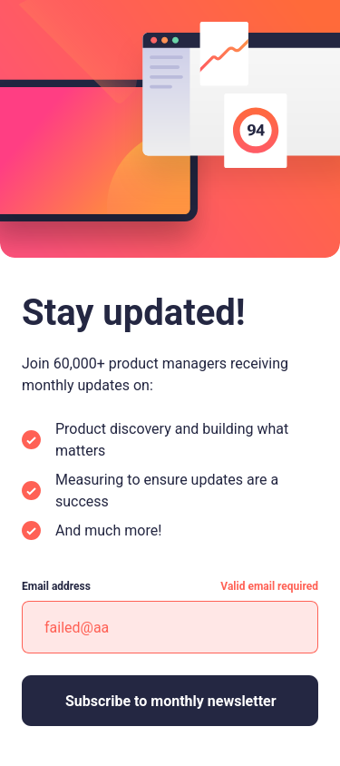
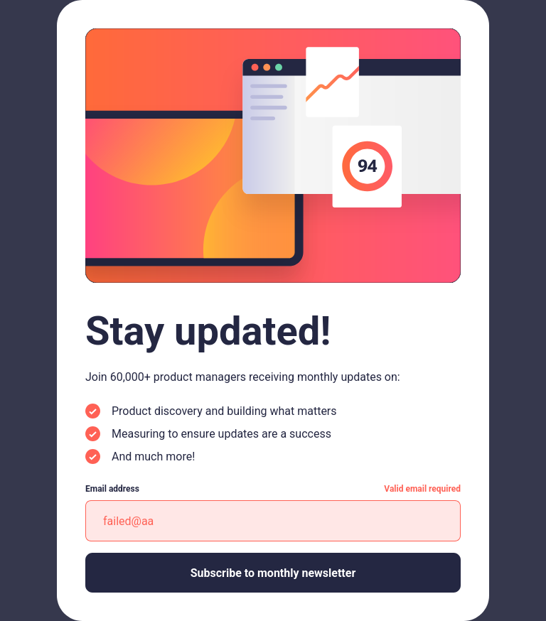
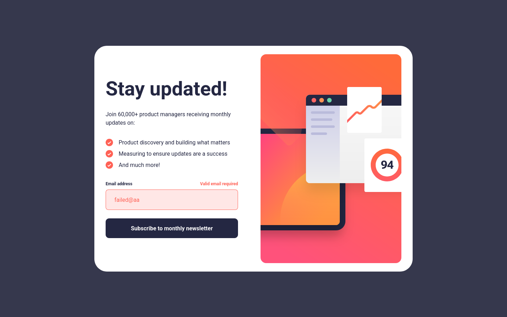

# Article preview component challenge solution

This is a solution to the [Newsletter sign-up form with success message challenge on Frontend Mentor](https://www.frontendmentor.io/challenges/newsletter-signup-form-with-success-message-3FC1AZbNrv).

## Table of contents

- [Overview](#overview)
    - [The challenge](#the-challenge)
    - [Screenshot](#screenshot)
    - [Links](#links)
- [My process](#my-process)
    - [Built with](#built-with)
    - [What I learned](#what-i-learned)
- [Author](#author)

**Note: Delete this note and update the table of contents based on what sections you keep.**

## Overview

### The challenge

Users should be able to:

- Add their email and submit the form
- See a success message with their email after successfully submitting the form
- See form validation messages if:
    - The field is left empty
    - The email address is not formatted correctly
- View the optimal layout for the interface depending on their device's screen size
- See hover and focus states for all interactive elements on the page

### Screenshot
|             **Mobile**              |             **Tablet**              |
|:-----------------------------------:|:-----------------------------------:|
|  |  |

|              **Desktop**              |
|:-------------------------------------:|
|  |

### Links

- Solution URL: [Frontend Mentor](https://www.frontendmentor.io/solutions/newsletter-responsive-sign-up-form-htmltailwind-29nNMcFt4T)
- Live Site URL: [GitHub Pages](https://lowkkid.github.io/newsletter-sign-up-form-with-success-message/)

## My process

### Built with

- Semantic HTML5 markup
- [Tailwind](https://tailwindcss.com/) for styles
- Plain JS
- Flexbox
- Mobile-first workflow

### What I learned

I improved my skills in vanilla JavaScript (working with forms), learned about best practices of working with forms, and responsive images with `<picture`> and `<source>`.  I also practiced Tailwind

## Author

- Website - [lowkkid.dev](https://lowkkid.dev)
- Frontend Mentor - [@lowkkid](https://www.frontendmentor.io/profile/lowkkid)

